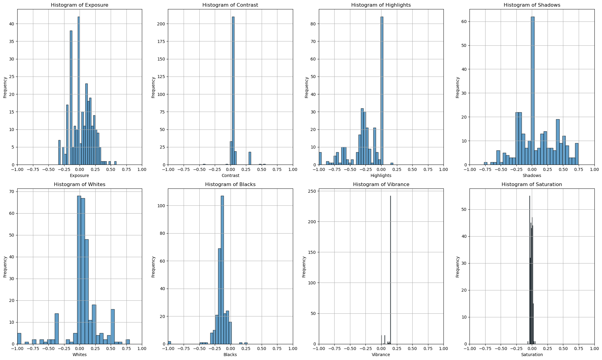
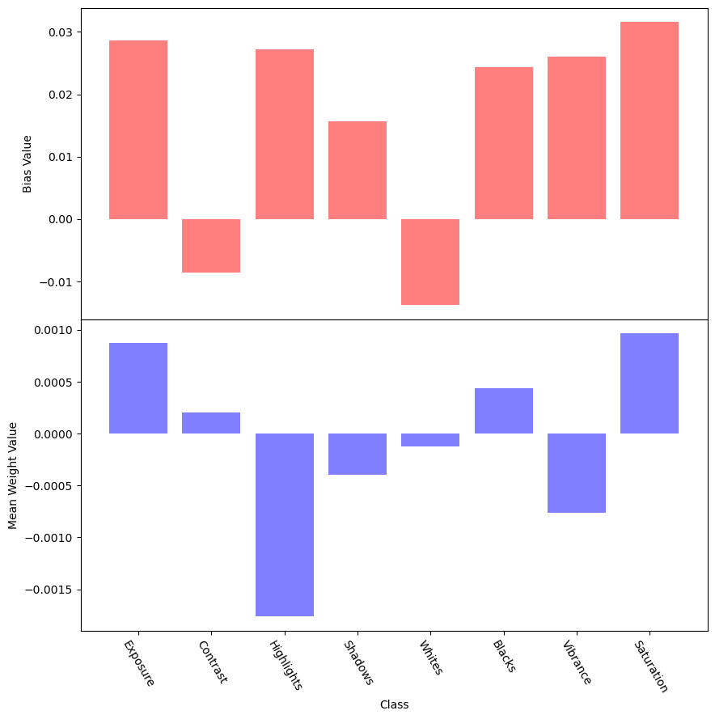
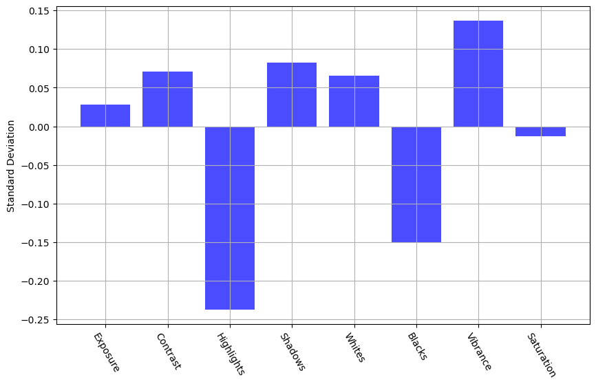
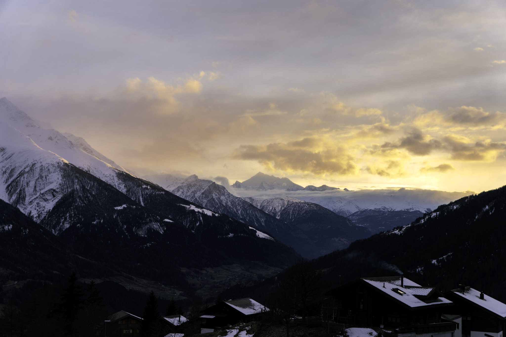
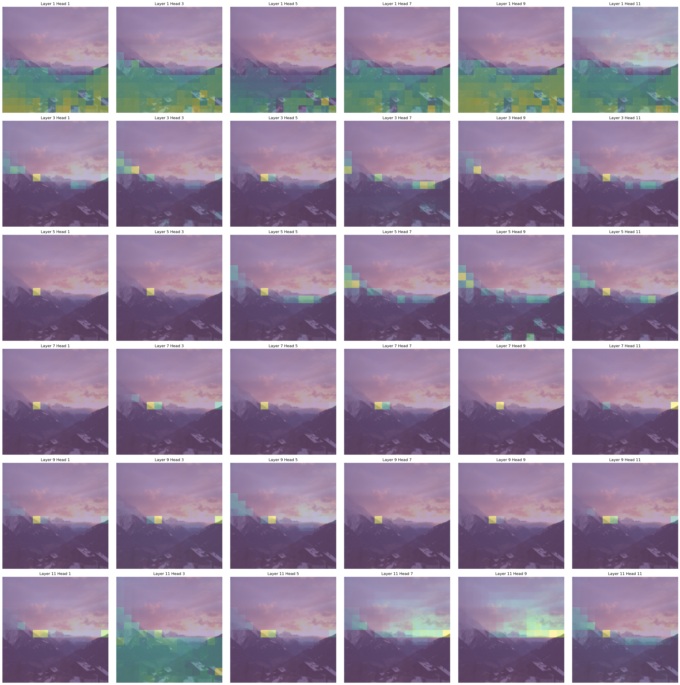

*joint work of [Lucas Schmitt](https://lucas-schmitt.de) and [Viktor Stein](https://stani-stein.com)*

Best viewed in an HDR compatible browser (Chrome) on an HDR compatible display.

# Abstract
This project develops an algorithm to optimize high dynamic range (HDR) image editing settings in Adobe Lightroom for RAW images. Current auto-adjustment algorithms do not fully utilize HDR's expanded brightness spectrum, resulting in less dynamic images. Our solution employs a Vision Transformer (ViT) model trained on a small dataset of RAW images with corresponding Lightroom settings. The model predicts optimal adjustments for exposure, contrast, highlights, shadows, whites, blacks, vibrance, and saturation, enhancing HDR image quality. Key techniques include data augmentation and label smoothing to improve model performance. This algorithm offers photographers a tool for achieving superior HDR image enhancements with minimal manual adjustments.

# Introduction
Modern photography software like Adobe Lightroom and Darktable play a crucial role in the digital photography workflow, particularly for photographers who shoot in RAW format. RAW files contain unprocessed data directly from a camera's image sensor, preserving the highest possible quality and providing extensive flexibility for post-processing. Unlike JPEGs, which are compressed and processed in-camera, RAW files allow photographers to make significant adjustments to exposure, color balance, contrast, and other parameters without degrading image quality. This capability is essential for professional photographers and enthusiasts seeking to achieve the highest quality results.

The workflow of shooting in RAW typically begins with capturing images using a camera set to save files in the RAW format. These files are then imported into software like Lightroom or Darktable, where photographers can adjust various settings to enhance the images. The software offers a wide range of tools for fine-tuning, such as adjusting white balance, exposure, shadows, highlights, and color saturation. This non-destructive editing process means that the original RAW file remains unchanged, and all adjustments are stored as metadata. This allows for endless experimentation and refinement until the desired outcome is achieved. The RAWs themself are usually captured as neutral as possible allowing the most flexibility in edit. This however also means that the RAWs are usually quite flat and grey, making the editing of every photo almost a necessity. 

Given the complexity and variety of adjustments available, finding the optimal settings can be a time-consuming process, especially if one edits a large set of images of an event. Therefore most photographers are deeply familiar with Lightroom's Auto Settings (Shift + A). This algorithm suggests values for some of the most important settings (Exposure, Contrast, Highlights, Shadows, Whites, Blacks, Vibrance, Saturation and some more). Most of the time these suggestions yield vibrant pictures that only need small adjustments to a subset of these settings. Therefore, a usual workflow might be to apply autosettings to all images and to only retouch a subset of the settings for each image, saving a lot of time.

## HDR Photography
Since October 2023 Adobe Lightroom has added native support for high dynamic range (HDR) image editing. HDR images contain more data per pixel, allowing the image to reach higher brightness values without oversaturating shadows. An HDR compatible display will now be able to ramp up the brightness of these areas significantly, whilst still keeping the shadows dark.

You can check if your current display supports HDR by comparing the images below. If they appear similar, then your display does not support HDR. On a proper HDR display the sun on the right picture should almost be blinding and shadows should be rich in detail, just as your eye would experience it in real life.

<table>
  <tr>
    <th>Unedited Raw</th>
    <th>Non HDR Image</th>
    <th>HDR Image</th>
  </tr>
  <tr>
    <td></td>
    <td></td>
    <td></td>
  </tr>
</table>


Fig 1: The image on the left is an unedited RAW image, the one in the middle has been edited and exported using a standard non HDR workflow and the image on the right with an HDR workflow. If the two edited images appear the same to you, then your browser/display do not support HDR playback. 

HDR technology is still in its early stages, so most displays do not support it yet. However, your phone might, as it typically offers the best display quality for the average consumer. Most laptops can not increase the brightness of a subset of pixels significantly without also increasing the brightness of dark parts. Therefore the bright parts of the HDR image are artificially darkened, destroying the HDR effect.

The only problem with Adobe's HDR implementation is that the autosettings do not consider the expanded brightness space. They tend to compress the brightness scale down to the usual allowed brightness scale. Therefore the blinding sunset becomes just bright and the dark shadow becomes brighter. The whole image now seems as grey as if it were not using HDR. A photographer would now need to adjust every single setting to restore the HDR effect, negating the usefulness of the autosettings.

<table>
  <tr>
    <th>Adobe Autosettings</th>
    <th>Model Predicted Autosettings</th>
  </tr>
  <tr>
    <td></td>
    <td></td>
  </tr>
</table>

Fig 2: On the left the settings suggested by Lightroom, on the right the settings suggested by our algorithm. Notice how Lightroom's implementation boosts the shadows and is not using the entire brightness spectrum available. We again point out the necessity for an HDR compatible browser/display.

The aim of the project is to write an algorithm that, given a small training dataset of RAWs with the corresponding Lightroom settings, finds a good suggestion for the settings to properly make use of the HDR colorspace.


# Architectural Concerns

Our model has 8 settings to play with. *Exposure* adjusts overall brightness, ensuring a balanced level where both shadows and highlights retain detail without overexposure or underexposure. *Contrast* controls the difference between dark and light areas, essential for HDR. *Highlights* manage brightness in lighter parts, crucial for avoiding overexposure and maintaining detail in bright regions. *Shadows* adjust brightness in darker areas, vital for revealing details without making them unnaturally bright. Similarly one can adjust *Whites*, *Blacks*, *Vibrance* and *Shadows*. That is why our model needs to understand the effect of the settings on both the darkest and the brightest areas of the images at the same time. In other words, we have long range dependencies. Our choice therefore lands on the Vision Transformer introduced in [Dosovitskiy et al., 2020].


The settings are all in the interval (-100,100) except for Exposure which lies in (-5,5). So, we scale all these intervals down to (-1,1) and train our model to $(-1,1)^n$ by choosing $\operatorname{tanh}()$ as the final activation of our ViT. After training we rescale the logits to use them in Lightroom. To use the standard Google ViT, we replace the final layer as follows:

```python
model = ViTForImageClassification(config)

model.classifier = nn.Sequential(
    nn.Linear(model.config.hidden_size, self.num_classes),
    nn.Tanh()
)
```


# Loading and preprocessing Data
One of the main challenges is to load and preprocess the available data in an efficient way. Since we are using a pretrained Vision Transformer, we need to ensure that our patch size is consistent with the 14 x 14 patches used in [Dosovitskiy et al., 2020]. The easiest way to achieve this is to directly downsample and normalize to rgb images of size 224x224, as this is consistent with the downsampling of ImageNet employed in the foundation model. With the following workflow we preprocess RAW data to PyTorch-tensors containing the normalized image data.
```python
def preprocess_image(self, rgb_array):
    preprocess = transforms.Compose([
        transforms.ToTensor(), 
        transforms.Resize((224, 224)),
        transforms.Normalize(mean=[0.485, 0.456, 0.406], std=[0.229, 0.224, 0.225]),
    ])
    img_tensor = preprocess(rgb_array)
    return img_tensor
```
To get the corresponding labels we need to read the XMP-files and extract the values. As mentioned above it is also necessary to rescale all values to $(-1,1)$.
```python
values = [
    5 ** (-1) *float(root.find('.//rdf:Description[@crs:Exposure2012]', ns).attrib['{http://ns.adobe.com/camera-raw-settings/1.0/}Exposure2012']),
    100 ** (-1) *float(root.find('.//rdf:Description[@crs:Contrast2012]', ns).attrib['{http://ns.adobe.com/camera-raw-settings/1.0/}Contrast2012']),
    ...
]
```
Throughout the process of development it turned out that loading a RAW using rawpy is the most time expensive task in the data-preparation process.
Nevertheless, we want to stick to the PyTorch-Dataset framework to make use of the Pytorch-Dataloader later on. As a consequence, we need a framework where training data can be directly accessed without reloading the RAWs every time.

To solve this problem we separated the Dataset architecture into three parts: *RawImageDatatset*, *ImageDataset* and *AugmentedDataset*. The task distribution is now the following: The first one is used to access the RAW and XMP files and does all the preprocessing work, the second one uses a RawImageDataset to store all needed data in a way it can be accessed time efficiently. The last one offers all possibilities of data augmentation or label smoothing without interfering with the technical parts.

To bring theses structures together, we initialize a RawImageDataset that enables us to access preprocessed data. We then hand this raw data to a ImageDataset which loads every image via the RawImageDataset framework and then stores it as PyTorch tensors. We are now able to directly access the tensors which are rapidly loaded using the torch.load function.

Since we stick to the general framework, we are able to use methods from torch.utils.data that do further ML related preprocessing as splitting the dataset or creating batches for training.
```python
raw_data = RawImageDataset(directory_path)
tensor_data = ImageDataset(raw_data, reload_data=reload_data)
    
base_data, val_data = torch.utils.data.random_split(tensor_data, validation_split)
```

# Model training
Our training data is quite limited (~350 images). Thus, we followed two approaches from the beginning: utilizing a pretrained foundation model and data augmentation. In contrast to the recommendation of using high resolution images for downstream tasks [Dosovitskiy et al., 2020], we instead scale down to 244 x 244 to match the pretraining data. We did this initially for faster training during the prototyping phase, but noticed, that this resolution is sufficient for our task.

As the labels are continuous values we employ an MSE loss and train using Adam in 10 epochs using batches of size 12 with a validation split of [0.8, 0.2] and a low learning rate of 0.0005.

## With and without pretraining
We initialize Google's vit-base-patch16-224 ViT, replace the classifier and start training. We expected that during fine tuning we would need to carefully consider which layers to freeze and which layers to train. In actuality the naive approach of letting the model adjust all training parameters with the same learning rate works incredibly well converging after essentially one epoch. Therefore we also compared training without pretraining and see, that whilst convergence is a bit slower, the model also learns to capture the correct relationship.

| With Pretraining | Without Pretraining |
| :------: | :------: |
|  |  |

Fig 3: We see that the network pretty much converges after the first epoch until it eventually overfits. We will later try to mitigate the overfitting using label smoothing (see section [Label Smoothing](#label-smoothing)). In both cases the final loss is usually around 0.02.

Even though both the pre- and the unpretrained approach both prove very successful, we try to further push the effectiveness of our training. The idea is that a photographer might want to establish a certain style for a single photo shoot. If he now were to edit a small subset of these images in that style, the algorithm can quickly pick up on it and edit the rest. For this however we need to learn effectively on very small datasets. We therefore introduce data augmentation. It will prove similarly effective (see section [Evaluating Data Augmentations](#Evaluating-Data-Augmentations)).

# Falsification Attempt
 Before we pursue data augmentation, we want to better understand the networks almost unreasonable performance. For this, we investigate the training data and the attention heads.

## Understanding the Data
Our first suspicion for the unreasonable performance of our network is, that the data has a very simple structure. It might be possible, that settings such as Exposure or Saturation are essentially the same for all images in the training data. If this were the case, the network could always make a constant guess without being penalized significantly. We are therefore interested in the underlying statistics of the training labels.



Fig 4: Histogram of the labels in the training dataset

We can clearly see, that some labels are actually quite simple. Saturation and Vibrance almost always have the same value. We expect that the network learns low weights and a bias reflecting the value for these settings.



Fig 5: In red the bias value for each setting and in blue the average connection strength to that node.

We can see that this hypothesis was false. There is no clear pattern of a specific bias with low connections to it. Keep in mind that due to regularization the average magnitude of incoming connections is also essentially the same for all nodes. Furthermore the plot is anything but constant for different runs indicating that the network is actually responding to the image and not just making a fixed guess.

Still, we suspect that a fixed guess might perform quite well. We therefore calculate the mean and standard deviation for each label and construct a simple guesser that picks its label suggestions from a normal distribution with the calculated variance and standard deviation. This guesser considers only the label space and does not take the input image into consideration.



Fig 6: Mean and standard deviation of labels in training dataset.

We evaluate this guesser on the validation set with an 80, 20 training - validation split and get a quite consistent loss of ~8%. This is definitely a very good performance considering the guesser did not look at the actual image. It is therefore fair to say that the underlying data is quite homogenous. Still, the random guesser is fortunately outperformed by our ViT model, which consistently achieves loss rates of around ~2%.

## Understanding the Attention Heads
We now seek to understand the attention heads. The hope is that there is a certain structure here, indicating that the network is actually considering different aspects of the input image. As the settings affect the brightness spectrum of the image, we hypothesize that the network should pay attention to shadows, highlights and especially bright light sources (such as the sun).

The ViT works on 16 x 16 tokens plus the cls token in 12 layers using 12 attention heads. For our visualization we highlight the patches that were most attended by each attention head for the cls token. We select a subset of layers and attention maps to make it a bit less convoluted.

| Input | Attention Maps |
| :------: | :------: |
|  |  |

Fig 7: The left image was provided as input to the model, and a subset of attention heads was chosen for the right visualization. We selected every second attention head from every second transformer layer.

Although interpreting attention maps should always be done with a grain of salt, one can tell that heads generally focus on specific brightness regions. This indicates that the network's suggestion is actually based on the input data as it pays attention to similar areas in the images as a photographer would do when determining brightness settings.

Overall, it is fair to say that even though the underlying data is not too complicated, that is at least not taking obvious escapes such as learning specific values independent of the input.

# Data Augmentation
Having only a limited amount of labeled data at hand, the generation of synthetic data is a natural approach to improve the sufficiency and diversity of training data. Without such augmention, the model risks overfitting to the training data. The basic idea of augmenting data for training is to introduce minor modifications to the data such that it remains close to the original but exhibits slight variations. For computer vision tasks this means to one changes small aspects of the image while keeping the main content recognizable, e.g. change the background when the task is to detect an object in the foreground. For object detection tasks there are extensive surveys available describing applicable data augmentation methods and providing a numerical analysis of their performance, see [Kumar et al., 2023] and [Yang et al., 2022]. However, our problem sets a different task to solve: we aim to recognize objects and their luminosity relative to the rest of the image. Due to the lack of specific performance data on available methods for this particular problem, we select seven promising basic data augmentation methods and apply them to the problem to evaluate their effectiveness.

## Data Augmentation methods

We follow the taxonomy of basic data augmentation methods proposed by [Kumar et al., 2023]. For common methods, we use the available implementations provided by torchvision. The last two augmentation methods, not available within any ML framework, were manually implemented based on the respective papers. In the following, we introduce each method that is used in the training process and give a brief heuristic explanation how we think the method could benefit or harm the training.


### Geometric Image Manipulation
**Rotation and Flipping**

As a first basic method to augment our training data we use flipping and rotating which preserves the structure and content of the picture, thus minimizing the risk of loosing important information. However, due to its simplicity, it is not able to generate diverse data.

```python
imgs = [original_img]
imgs.append(transforms.functional.hflip(original_img))
for i in range(3):
    imgs.append(transforms.functional.rotate(original_img, 90.0*i))
    imgs.append(transforms.functional.rotate(transforms.functional.hflip(original_img), 90.0*i))
plot_images(imgs)
```


**Shearing**

By randomly shearing the picture, we -heuristically speaking- providing the model with different perspectives on the picture. Technically, we are changing the proportion of the objects and their spatial relations. This seems to be a good approach for our task as the luminosity of the picture should not depend on the specific shapes of the objects. However, one drawback is that shearing can generate black, and thus dark, regions on the border of the image.

```python
imgs = [original_img]
for _ in range(3):
    transforms.RandomPerspective(distortion_scale=0.2, p=1.0)(original_img)
plot_images(imgs)
```


### Non-Geometric Image Manipulation

**Random Cropping and Resize**

Randomly cropping a patch from the original picture aims to create a different context for the objects included. We hope to to exclude uninteresting or even distracting elements on the image edges and focus on the main content in the center. Of course this is based on the assumption that we do not loose any crucial information by cropping. As before, the structure and colors of the main content remain untouched.

```python
imgs = [original_img]
for _ in range(3):
    size = (original_img.shape[1],original_img.shape[2])
    imgs.append(transforms.RandomResizedCrop(size, scale=(0.75,1.0))(original_img))
plot_images(imgs)
```


**Distortion**

Instead of loosing a whole region of the picture and leaving another region completely untouched, we try to add uncertainty to the structure on the whole picture. By adding distortion we reduce the sharpness of the edges of the objects. Since the task possibly involves detecting regions of varying light intensity, which are usually not separated by sharp edges, this approach hopefully supports the model training.

```python
imgs = [original_img]
for i in range(3):
    imgs.append(transforms.ElasticTransform(alpha=[50.+50.*i])(original_img))
plot_images(imgs)
```


**Gaussian blurring**

With the same heuristics as before we apply a gaussian blur to the whole picture. As the object itself stays untouched in terms of shape and luminosity, this augmentation method should also go along well with our training task.

```python
imgs = [original_img]
for _ in range(3):
    imgs.append(transforms.GaussianBlur(kernel_size=(9,9), sigma=(0.1,5.0))(original_img))
plot_images(imgs)
```


### Image Erasing
By taking out parts of the image one hopefully drops out dominant regions that could prevent the model from learning less sensitive information beforehand. Without them, we enhance a more robust model. However, these methods may inadvertently remove important parts relevant to our task. Known examples for Image Erasing are random erasing, cutout or hide-and-seek, see [Kumar et al., 2023].
**Gridmask deletion**
The perviously mentioned dropout methods have two main problems for our task. Since they delete a continuous region or an excessive amount of data they tend to delete important parts for our task, i.e. as our problem cannot be fully reduced to object identification we cannot be sure which part of the background is important. To overcome these problems, in [Chen et al., 2020] the so-called GridMask data augmentation method is introduced.
Here a grid consisting of small mask units is created, where the parameter $$r\in (0,1)$$ denotes the ratio of the shorter visible edge in a unit, and the unit size $$d=\text{random}(d_{min},d_{max})$$ is randomly chosen. Lastly the distances $$\delta_x,\,\delta_y\in (0,d-1)$$ between the first intact unit and the boundary of the image are also chosen randomly. For these parameters a grid mask is created which is later applied to the actual image.
```python
def grid_mask(shape, r, d, delta_x, delta_y):
    mask = torch.ones(shape)
    ones_l = round(r*d)
    zeros_l = d-ones_l
    start_x, start_y = delta_x, delta_y

    while start_x<= shape[1]:
        end_x = min(start_x+zeros_l, shape[1])
        
        while  start_y<=shape[2]:
            end_y = min(start_y+zeros_l, shape[2])
            mask[:,start_x:end_x, start_y:end_y] = 0
            start_y = end_y + ones_l
        start_x = end_x + ones_l
        start_y = delta_y   

    return mask
```
The experiment results in [Chen et al., 2020] show a higher accuracy when training a ResNet under the usage of GridMask compared to standard image erasing methods on the ImageNet Dataset.
```python
imgs = [original_img]
for _ in range(3):
    imgs.append(gridmask_deletion(original_img, r=0.6, d_min=30, d_max=70))
plot_images(imgs)
```


### Advanced Image Manipulation
**Local Rotation**
This method is introduced in [Kim et al., 2021] as part of a collection of local augmentation methods. In this case local rotation can be seen as a further development of global rotation. It was developed as an augmentation method for CNNs. As CNNs are biased to local features which is a disadvantage for generalization, we cut the picture in four patches that are then randomly rotated and glued together. In this way we might break up some strong local features, which should be advantageous for our problem that is mainly interested in the global luminosity. In [Kim et al., 2021] it is stated that the CIFAR100 test accuracy for a ResNet is superior if local rotation is used compared to global rotation.

The local rotation introduces significant discontinuities into the image. This might be detrimental for tasks such as object recognition, as permutations might lead to objects being ripped apart. But for our task the locations should not destroy the training data, as the global illumination of the image stays essentially the same.

```python
imgs = [original_img]
for _ in range(3):
    imgs.append(local_rotation(original_img))
plot_images(imgs)
```


# Label smoothing
Label smoothing tackles the problem that the labels in the dataset are noisy. This noise is especially relevant in our dataset, as in the artistic process of editing a photo, there are no right or wrong settings. Furthermore if you were to give a photographer the same photo to edit twice, we are quite certain, that the result would not be the same.

[Szegedy et al., 2016] introduces label smoothing for classification tasks, by assuming that for a small $\varepsilon>0$ the training set label is correct with only probability $1-\varepsilon$ and incorrect otherwise. We now strive to come up with a similar mechanism for regression tasks reflecting the lack of a correct choice in the task.

## Label smoothing methods
As there are no discrete classes but continuous values we work with two different approaches to smooth the labels. In the first approach, given a sequence of training labels, we apply a moving average across the dataset for each label dimension. For the second approach, we add random gaussian noise to each value, based on the assumptions that whilst the label does not need the exact value as given in the training data, it should still be roughly in the same ballpark. The implementation details of these smoothing methods are provided below. We hope, that this smoothing decreases overfitting.
```python
def smoothing(labels, method='moving_average', window_size=5, sigma=2):
    if method == 'moving_average':
        # Apply moving average smoothing
        if window_size > 0:
            smoothed_labels = np.convolve(labels, np.ones(window_size)/window_size, mode='same')
        else: 
            smoothed_labels = labels
    elif method == 'gaussian':
        # Apply Gaussian smoothing
        smoothed_labels = scipy.ndimage.gaussian_filter1d(labels, sigma=sigma)
    else:
        raise ValueError("Unsupported smoothing method")
    return smoothed_labels
```


# Evaluating Data Augmentations
For evaluation we iterate over every possible augmentation method and select hyperparameters such that the amount of data is increased by factor eight. This value is chosen since it is the maximal factor using flipping and rotation and we want to obtain comparable results. Each augmentation method is combined with either no label smoothing, moving average or gaussian smoothing. Overall we obtain 21 possible combinations of label smoothing and data augmentation. For each of them the model is trained 30 times with a 0.05/0.95 training/validation split, simulating extreme data scarcity. We average the validation losses across all 30 models.


Fig 8: Comparison average epoch validation losses of different augmentations. See [stani-stein.com/AutoHDR](https://www.stani-stein.com/AutoHDR/#evaluating-data-augmentations) for an interactive version of the plot.

What immediately catches the eye, is that data augmentation in principle has a positive impact on the model's performance. Sobering, however is the impact of label smoothing. Without data augmentation it even seems to have a negative effect. At least on augmented data the models that are trained on smoothed data perform better than the ones with untreated labels. This suggests the assumption that having a certain amount of training data available is necessary for label smoothing to work. But this question is up to another evaluation since the observed effect is not pronounced.

It is hard to say what augmentation works the best. It is however fair to say, that smoothing does seem to help with the validation error, possibly due to reduced overfitting. Furthermore we are inclined to say, that image erasing performs the worst. This may be because the deleted spots are registered as shadows, messing up the algorithms understanding of the scenes lighting. Both effects are however not strong and require further inquiry. 

# Conclusion
Our algorithm manages to find a photographer's editing style from an extremely small dataset (15-20 images) allowing a photographer to edit a subset of a photo shoot and let the algorithm decide the rest. The algorithm also learns to match editing styles, that are typical for HDR photography solving our original goal. This greatly reduces the time needed to edit photos, mitigating one of the less fun aspects of photography. 
# References
[Chen et al., 2020] Chen, Pengguang, et al. "Gridmask data augmentation." arXiv preprint arXiv:2001.04086 (2020).

[Kim et al., 2021] Kim, Youmin, AFM Shahab Uddin, and Sung-Ho Bae. "Local augment: Utilizing local bias property of convolutional neural networks for data augmentation." IEEE Access 9 (2021).

[Kumar et al., 2023] Kumar, Teerath, et al. "Image data augmentation approaches: A comprehensive survey and future directions." arXiv preprint arXiv:2301.02830 (2023).

[Szegedy et al., 2016] Szegedy, Christian, et al. "Rethinking the inception architecture for computer vision." Proceedings of the IEEE conference on computer vision and pattern recognition. (2016).

[Yang et al., 2022] Yang, Suorong, et al. "Image data augmentation for deep learning: A survey." arXiv preprint arXiv:2204.08610 (2022).

[Dosovitskiy et al., 2020] Dosovitskiy, Alexey et al. “An Image is Worth 16x16 Words: Transformers for Image Recognition at Scale.” ArXiv abs/2010.11929 (2020): n. pag.