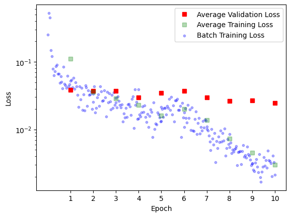

*joint work with [Lucas Schmitt](https://structures.uni-heidelberg.de/team.php?show_member_yrc=342)*

Best viewed in an HDR compatible browser (Chrome) on an HDR compatible display.

# Introduction
Modern photography software like Adobe Lightroom and Darktable play a crucial role in the digital photography workflow, particularly for photographers who shoot in RAW format. RAW files contain unprocessed data directly from a camera's image sensor, preserving the highest possible quality and providing extensive flexibility for post-processing. Unlike JPEGs, which are compressed and processed in-camera, RAW files allow photographers to make significant adjustments to exposure, color balance, contrast, and other parameters without degrading image quality. This capability is essential for professional photographers and enthusiasts seeking to achieve the highest quality results.

The workflow of shooting in RAW typically begins with capturing images using a camera set to save files in the RAW format. These files are then imported into software like Lightroom or Darktable, where photographers can adjust various settings to enhance the images. The software offers a wide range of tools for fine-tuning, such as adjusting white balance, exposure, shadows, highlights, and color saturation. This non-destructive editing process means that the original RAW file remains unchanged, and all adjustments are stored as metadata. This allows for endless experimentation and refinement until the desired outcome is achieved. The RAWs themself are usually captured as neutral as possible allowing the most flexibility in edit. This however also means, that the RAWs are usually quite flat and grey, making the editing of every photo allmost a nessecity. 

Given the complexity and variety of adjustments available, finding the optimal settings can be a time-consuming process, especially if one edits a large set of images of an event. Therefore most photographers are deeply familiar with Lightrooms Auto Settings (Shift + A). This algorithm suggests values for some of the most important settings (Exposure, Contrast, Highlights, Shadows, Whites, Blacks, Vibrance, Saturation and some more). Most of the time these suggestions yield vibrant pictures that only need small adjustments to a subset of these settings. Therefor a usual workflow might be to apply autosettings to all images and to only retouch a subset of the settings for each image, saving a lot of time.

## HDR Photography
Since October 2023 Adobe Lightroom has added native support for high dynamic range (HDR) image editing. HDR images contain more data per pixel, allowing the image to reach higher brightness values without oversaturating shadows. An HDR compatible display will now be able to ramp up the brightness of these areas significanntly, whilst still keeping the shadows dark.

You can check if your current display supports HDR by comparing the two images below. If they appear similar, then your display does not support HDR. On a proper HDR display the sun should almost be blining and shadows should be rich in detail, just as your eye would experience it in real life.

<table>
  <tr>
    <th>Unedited Raw</th>
    <th>Non HDR Image</th>
    <th>HDR Image</th>
  </tr>
  <tr>
    <td></td>
    <td></td>
    <td></td>
  </tr>
</table>


Fig 1: The image on the left is an unedited RAW image, the one in the middle has been edited and exported using a standard non HDR workflow and the image on the right with an HDR workflow. If the two edited images appear the same to you, then your browser/display do not support HDR playback. 

HDR technology is still in its early stages, so most displays do not support it yet. However, your phone might, as it typically offers the best display quality for the average consumer. Most laptops can not increase the brightness of a subset of pixels significantly without also increasing the brightness of dark parts. Therefore the bright parts of the HDR image are artificially darkend, destroying the HDR effect.

The only problem with Adobe's HDR implementation is that the autosettings do not consider the expanded brightness space. They tend to compress the brightness scale down to the usual allowed brightness scale. Therefore the blinding sunset becomes just bright and the dark shadow becomes brighter. The whole image now seems as grey and if it were not using HDR. A photographer would now need to adjust every single setting to restore the HDR effect, negating the usefullness of the autosettings.

<table>
  <tr>
    <th>Adobe Autosettings</th>
    <th>Model Predicted Autosettings</th>
  </tr>
  <tr>
    <td></td>
    <td></td>
  </tr>
</table>

Fig 2: On the left the settings suggested by Lightroom, on the right the settings suggested by our algorithm. Notice how Lightroom's implementation boosts the shadows and is not using the entire brightness spectrum available. We again point out the nescessity for an HDR compatible browser/display.

The aim of the project it to write an algorithm that, given a small training dataset of RAWs with the corresponding Lightroom settings, finds a good suggestion for the settings to properly make use of the HDR colorspace.


# Architectual Concerns

Our model has 8 settings to play with. Exposure adjusts overall brightness, ensuring a balanced level where both shadows and highlights retain detail without overexposure or underexposure. Contrast controls the difference between dark and light areas, essential for HDR. Highlights manage brightness in lighter parts, crucial for avoiding overexposure and maintaining detail in bright regions. Shadows adjust brightness in darker areas, vital for revealing details without making them unnaturally bright. In other words or model needs to understand the effect of the settings on both the darkest and the brightest areas of the images at the same time; we have long range dependencies. Our choice therefore lands on a Vision Transformer.


The settings are all in the interval (-100,100) exept for Exposure which lies in (-5,5). We can scale all these intervalls down to (-1,1) and train our model to $(-1,1)^n$ by choosing $\operatorname{tanh}()$ as the final activation of our ViT. After training we can rescale the logits to use them in Lightroom. If we want to use the standard Google ViT we can just replace the final layer as follows:

```python
model = ViTForImageClassification(config)

model.classifier = nn.Sequential(
    nn.Linear(model.config.hidden_size, self.num_classes),
    nn.Tanh()
)
```


# Loading and preprocessing Data
One of the main challenges is to load and preprocess the available data in an efficient way. As we are using a Vision Transformer that is pretrained on normalized rgb images of size 224x224 it is senseful to transform our data to the same shape. So, with the following workflow we preprocess RAW data to PyTorch-tensors containing the  normalized image data.
```python
def preprocess_image(self, rgb_array):
    preprocess = transforms.Compose([
        transforms.ToTensor(), 
        transforms.Resize((224, 224)),
        transforms.Normalize(mean=[0.485, 0.456, 0.406], std=[0.229, 0.224, 0.225]),
    ])
    img_tensor = preprocess(rgb_array)
    return img_tensor
```
To get the corresponding labels we need to read the XMP-files and extract the values. As mentioned above it is also neccessary to rescale all values to $(-1,1)$.
```python
values = [
    5 ** (-1) *float(root.find('.//rdf:Description[@crs:Exposure2012]', ns).attrib['{http://ns.adobe.com/camera-raw-settings/1.0/}Exposure2012']),
    100 ** (-1) *float(root.find('.//rdf:Description[@crs:Contrast2012]', ns).attrib['{http://ns.adobe.com/camera-raw-settings/1.0/}Contrast2012']),
    ...
]
```
Throughout the process of developement it turned out that loading a RAW using rawpy is the most time expensive task in the data-preparation process.
Nevertheless we want to stick to the PyTorch-Dataset framework to make use of the Pytorch-Dataloader later on. This means that we need a framework where training data can be directly accessed without reloading the RAWs every time.

To solve this problem we seperated the Dataset architecture in three parts: RawImageDatatset, ImageDataset and AugmentedDataset. The task distribution is that the first one is used to access to RAW and XMP files and does all preprocessing work, the second one uses a RawImageDataset to store all needed data in a way that it can be accessed time efficiently. The last one offers all possibilitys of data augmentation or label smoothing without interferring with the technical parts.

The workflow is then the following: we initialize a RawImageDataset that enables us to access preprocessed data. We then hand this raw data to a ImageDataset which loads every image via the RawImageDataset framework and then stores it as PyTorch-tensors. We are now able to directly access the tensors which are rapidly loaded using the torch.load function.

Since we stick to the general framework we are able to use methods from torch.utils.data that do further ML relatet preprocessing as splitting the dataset or creating batches for training.
```python
raw_data = RawImageDataset(directory_path)
tensor_data = ImageDataset(raw_data, reload_data=reload_data)
    
base_data, val_data = torch.utils.data.random_split(tensor_data, validation_split)
```

# Model training

Our training data is quite limited (~350 images). Thus we followed two approaches from the begining: Utilizing a pretrained foundation model and data augmentation.

As the labels are continuous values we employ an MSE loss and train using Adam in 10 epochs using batches of size 12 with a validation split of [0.8, 0.2] and a low learning rate of 0.0005.

## With and without pretraining

We initialize Google's vit-base-patch16-224 ViT, change out the classifyer and start training. We expected, that during fine tuning we'd need to carefully consider which layers to freeze and which layers to train. In actuallity the naiv approach of letting the model adjust all training parameters with the same learning rate works increadibly well converging after essentially one epoch. Therefore we also compared training without pretraining and see, that whilst convergence is a bit slower, the model also learns to capture the correct relationship.

| With Pretraining | Without Pretraining |
| :------: | :------: |
|  |  |

Fig 3: We see that the network pretty much converges after the first epoch until it eventually overfits. We will later try to mitigate the overfitting using label smoothing (see section [Label Smoothing](#label-smoothing)). In both cases the final loss is usually around 0.02.

Even though both the pre- and the unpretrained approach both prove very successfull, we try to further push the effectiveness of out training. The idea is, that a photographer might want to establish a certain style for a single shooting. If he now were to edit a small subset of these images in that style, the algorithm can quickly pick up on it and edit the rest. For this however we need to learn effectively on very small datasets. We therefore introduce data augmentation. It will prove similarly effective (see section [Evaluating Data Augmentations](#Evaluating-Data-Augmentations)).

# Data Augmentation
Having only a limited amount of labeled data at hand, the generation of synthetic data is a natural approach to improve the sufficiency and diversity of training data. Otherwise, the model could end up over-fitting to the training data. The basic idea of augmenting data for training is to make small modifications to the data such that it is close to the real one but slightly different. For computer vison tasks this means to one changes small parts of the picture such that the main content stays recognisable, e.g. change the background when the task is to detect an object in the foreground. For object detection tasks there are extensive surveys available describing applicable data augmentation methods and providing a numerical analysis of their performance, see [Kumar et al., 2023] and [Yang et al., 2022]. However, our problem sets a different task to solve: recognising objects and their luminosity relative to the rest of the picture. Due to the lack of experience of the performance of the methods available, we pick seven promising basic data augmentation methods and apply them to the problem to see how they perform.

## Data Augmentation methods

We follow the taxonomy of basic data augmentation methods proposed by [Kumar et al., 2023]. For common methods we use the available implementations provided by torchvision. For the last two augmentation methods there are no implementations available inside a ML framework so we implemented them manually based on the corresponding paper. In the following we introduce each method that is used for the training process and give a short heuristical explanation how we think the method could benefit or harm the training.

### Geometric Image Manipulation
**Rotation and Flipping**

As a first basic method to augment our training data we use flipping and rotating which keeps the structure and content of the picture intact and thus do not run the risk of loosing important information. However, beeing that simple it is not able to generate diverse data.

```python
imgs = [original_img]
imgs.append(transforms.functional.hflip(original_img))
for i in range(3):
    imgs.append(transforms.functional.rotate(original_img, 90.0*i))
    imgs.append(transforms.functional.rotate(transforms.functional.hflip(original_img), 90.0*i))
plot_images(imgs)
```


**Shearing**

By randomly shearing the picture we are -heuristically speaking- giving the model different perspectives on the picture. Technically we are changing the proportion of the objects and its spatial relations. This seems to be a good approach for our task as the luminosity of the picture should not depend on the concrete shape of the objects included. What in fact could possibly lead to problems is that we are generating black, and thus dark, regions on the border of the picture.

```python
imgs = [original_img]
for _ in range(3):
    transforms.RandomPerspective(distortion_scale=0.2, p=1.0)(original_img)
plot_images(imgs)
```


### Non-Geometric Image Manipulation

**Random Cropping and Resize**

By randomly cropping a patch out of the original picture we hopefully create a different context for the objects included. This means that we try to leave out uninteresting or even disturbing elements on the edge of the picture and focus on the main content in the center. Of course this is based on the assumption that we do not loose any crucial information by cropping. As before the structure and colours of the main content stay untouched.

```python
imgs = [original_img]
for _ in range(3):
    size = (original_img.shape[1],original_img.shape[2])
    imgs.append(transforms.RandomResizedCrop(size, scale=(0.75,1.0))(original_img))
plot_images(imgs)
```


**Distortion**

Instead of loosing a whole region of the picture and leaving another region completly untouched, we try to add uncertainty to the structure on the whole picture. By adding distortion we lower the sharpeness of the edges of the objects. Since we try to enhance the model to detect regions of different light intensity which are usually not seperated by sharp edges, this approach hopefully supports the learning towards the task.

```python
imgs = [original_img]
for i in range(3):
    imgs.append(transforms.ElasticTransform(alpha=[50.+50.*i])(original_img))
plot_images(imgs)
```


**Gaussian blurring**

With the same heuristics as before we apply a gaussian blur to the whole picture. As the object itself stays untouched in terms of shape and luminosity, this augmentation method should also go along well with our training task.

```python
imgs = [original_img]
for _ in range(3):
    imgs.append(transforms.GaussianBlur(kernel_size=(9,9), sigma=(0.1,5.0))(original_img))
plot_images(imgs)
```


### Image Erasing
By taking out parts of the picture one drops out information that could help to learn less sensitive information which the resulst in a more robust model. Known examples for Image Erasing are random erasing, cutout or hide-and-seek, see [Kumar et al., 2023].
**Gridmask deletion**
The perviously mentioned dropout methods have two main problems for our task. Since they delete a continuous region or an excessive amount of data they might delete important parts for our task, i.e. as our problem cannot be fully reduced to object identification we cannot be sure which part of the background is important. To overcome these problems, in [Chen et al., 2020] the so-called GridMask data augmentation method is introduced.
Here a grid consiting of small mask units is created, where the parameter $$r\in (0,1)$$ denotes the ratio of the shorter visable edge in a unit, and the unit size $$d=\text{random}(d_{min},d_{max})$$ is randomly chosen. Lastly the distances $$\delta_x,\,\delta_y\in (0,d-1)$$ between the first intact unit and the boundary of the image are also chosen randomly. For these parameters a grid mask is created which is later applied to the actual image.
```python
def grid_mask(shape, r, d, delta_x, delta_y):
    mask = torch.ones(shape)
    ones_l = round(r*d)
    zeros_l = d-ones_l
    start_x, start_y = delta_x, delta_y

    while start_x<= shape[1]:
        end_x = min(start_x+zeros_l, shape[1])
        
        while  start_y<=shape[2]:
            end_y = min(start_y+zeros_l, shape[2])
            mask[:,start_x:end_x, start_y:end_y] = 0
            start_y = end_y + ones_l
        start_x = end_x + ones_l
        start_y = delta_y   

    return mask
```
The experiment results in [Chen et al., 2020] show a higher accuracy when training a ResNet under the usage of GridMask compared to standard image erasing methods on the ImageNet Dataset.
```python
imgs = [original_img]
for _ in range(3):
    imgs.append(gridmask_deletion(original_img, r=0.6, d_min=30, d_max=70))
plot_images(imgs)
```


### Advanced Image Manipulation
**Local Rotation**
This method is introduced in [Kim et al., 2021] as part of a collection of local augmentation methods. In this case local rotation can be seen as a further developement of global rotation. It was developed as an augmentation method for CNNs. As CNNs are biased to local features which is a disadvantage for generalization, we cut the picture in four patches that are then randomly rotated and glued toghether. In this way we might break up some strong local features, which should be advantegeous for our problem that is mainly interessted in the global luminosity. In [Kim et al., 2021] it is stated that the CIFAR100 test accuracy for a ResNet is superior if local rotation is used compared to global rotation.

The local rotation introduces significant discontinuities into the image. This might be detremental for tasks such as object recognition, as permutations might lead to objects being ripped appart. But for our task the locations should not destroy the training data, as the global illumination of the image stays essentially the same.

```python
imgs = [original_img]
for _ in range(3):
    imgs.append(local_rotation(original_img))
plot_images(imgs)
```


# Label smoothing
## Motivation
Label smoothing tackles the problem that the labels in the dataset are be noisy. As the labels are obtained by manually setting the values it is almost inevitable to have noisy labels. For classification tasks noisy labels are even more harmful as this means that a picture is misscategorized. In [Szegedy et al., 2016] the idea of label smoothing is introduced to overcome this problem: one then assumes that for a small $\varepsilon>0$ the training set label is correct with only probability $1-\varepsilon$ and incorrect otherwise.
## Label smoothing methods
As there are no discrete classes but contiuous values we work with two different approaches to smooth the labels. First, we locally adjust the values compared to each other, meaning that we create a series of averages by using the idea of a mathematical convolution with a constant function which heuristically can be seen as averaging out the values inside a window. Second, we add a random gaussian noise to each value based on the assumptions that all labels are noisy and exact labels are not available. So by noising the labels on purpose, we hopefully get a more robust model. The implementation of the smoothing is shown here.
```python
def smoothing(labels, method='moving_average', window_size=5, sigma=2):
    if method == 'moving_average':
        # Apply moving average smoothing
        if window_size > 0:
            smoothed_labels = np.convolve(labels, np.ones(window_size)/window_size, mode='same')
        else: 
            smoothed_labels = labels
    elif method == 'gaussian':
        # Apply Gaussian smoothing
        smoothed_labels = scipy.ndimage.gaussian_filter1d(labels, sigma=sigma)
    else:
        raise ValueError("Unsupported smoothing method")
    return smoothed_labels
```

# Evaluating Data Augmentations


Fig blah: Comparisson average epoch losses of different augmentations. We see that the augmentations perform similar and all significantly better then without augmentation. See [stani-stein.com/AutoHDR](https://www.stani-stein.com/AutoHDR/#evaluating-data-augmentations) for an interactive version of the plot.

## Attention Heads

## Comparing Augmentations

<iframe src="./interactive_plot.html" style="width: 100%; height: 600px; border: none;"></iframe>

## Simple Label Estimate

# References
[Chen et al., 2020] Chen, Pengguang, et al. "Gridmask data augmentation." arXiv preprint arXiv:2001.04086 (2020).

[Kim et al., 2021] Kim, Youmin, AFM Shahab Uddin, and Sung-Ho Bae. "Local augment: Utilizing local bias property of convolutional neural networks for data augmentation." IEEE Access 9 (2021).

[Kumar et al., 2023] Kumar, Teerath, et al. "Image data augmentation approaches: A comprehensive survey and future directions." arXiv preprint arXiv:2301.02830 (2023).

[Szegedy et al., 2016] Szegedy, Christian, et al. "Rethinking the inception architecture for computer vision." Proceedings of the IEEE conference on computer vision and pattern recognition. (2016).

[Yang et al., 2022] Yang, Suorong, et al. "Image data augmentation for deep learning: A survey." arXiv preprint arXiv:2204.08610 (2022).